<!-- Banner opcional: Puedes poner aquí una imagen de header si tienes una -->

  

  <h3 align="center">
  
</h3>
  
  
  
  
   

  🌱 **Actualmente explorando:** Offensive Security & Cloud Infrastructure
  🐧 **OS Principal:** Windows
  

---

### 👨‍💻 Sobre mí

¡Hola! Soy **Felipe Ramos**, Desarrollador de software. 

Mi pasión está en el **backend robusto**, la **arquitectura limpia** y la **ciberseguridad**. No solo escribo código; diseño sistemas que son escalables, mantenibles y seguros. Me muevo fluidamente entre el desarrollo, la infraestructura (DevOps) y la seguridad (SecOps).

- 🧠 **Filosofía:** Clean Architecture, SOLID, DDD & Design Patterns.
- 🛡️ **Seguridad:** Investigación activa en vulnerabilidades (CVEs), Pentesting y Hardening.
- 🎸 **Hobbies:** Tocar guitarra, Gaming (Bloons TD 🎈) y Anime.

---

### 🛠️ Tech Stack

#### **Core & Backend**

#### **Frameworks**

#### **DevOps & Cloud**

#### **Security & Tools**

---

<h3 align="center">📊 Mis Métricas de Desarrollo</h3>

<table style="border:none;border-collapse:collapse;margin:0 auto;">
<tr style="border:none;">
<td style="border:none;padding-right:15px;vertical-align:top;">

</td>
<td style="border:none;padding-left:15px;vertical-align:top;">

</td>
</tr>
</table>
 

  
<picture>
<source media="(prefers-color-scheme: dark)" srcset="https://raw.githubusercontent.com/feliperamos2612/feliperamos2612/output/github-contribution-grid-snake-dark.svg">
<source media="(prefers-color-scheme: light)" srcset="https://raw.githubusercontent.com/feliperamos2612/feliperamos2612/output/github-contribution-grid-snake.svg">

</picture>

---

  

